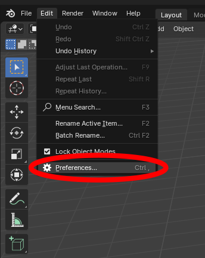
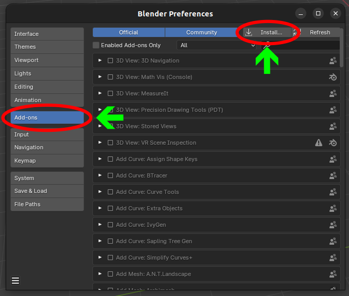
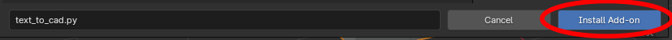
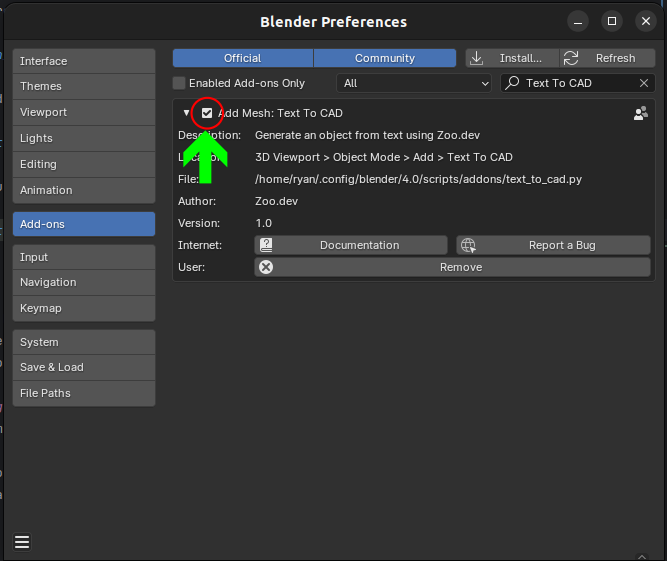
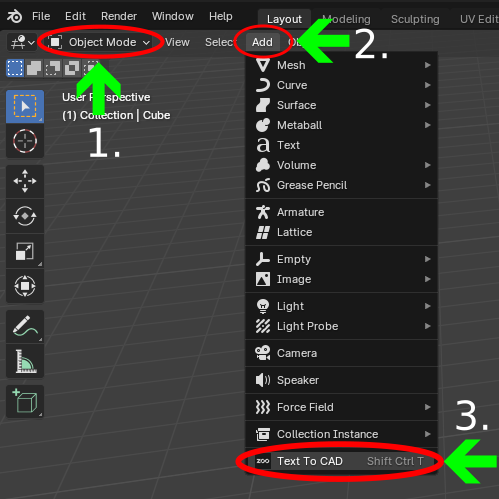
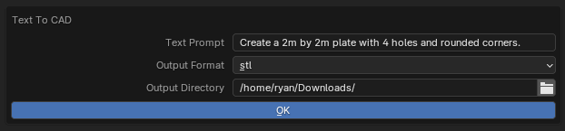

## Zoo's Text To CAD Plugin For Blender

A [Blender](https://blender.org) plugin to interact with Zoo's Text-to-CAD API, brought to you by the [Zoo Team](https://zoo.dev)

## Table of Contents

- [Zoo's Text To CAD Plugin For Blender](#zoos-text-to-cad-plugin-for-blender)
- [Table of Contents](#table-of-contents)
- [Prerequisites](#prerequisites)
- [Installation](#installation)
- [Usage](#usage)
- [Contributing](#contributing)

## Prerequisites

1. Create an account at [zoo.dev/signup](https://zoo.dev/signup)
2. Create an API token for your account at [zoo.dev/account/api-tokens](https://zoo.dev/account/api-tokens)
3. Add your API token to your OS environment with the name `KITTYCAD_API_TOKEN`. In order to user our API, you'll need to provide an API token, the blender plugin will automatically look for it.
   1. For each OS there are different ways of adding an environment variable Here are several guides
      1. <https://superuser.com/questions/949560/how-do-i-set-system-environment-variables-in-windows-10>
      2. <https://apple.stackexchange.com/questions/106778/how-do-i-set-environment-variables-on-os-x>
      3. <https://askubuntu.com/a/58828>

## Installation

Download the [text_to_cad.py](src/text_to_cad.py) from [`src`](src)

Open the preferences menu in Blender. *Edit* -> *Preferences*

Select the *Addons* tab and click the *Install* button

Navigate to your downloaded *text_to_cad.py* and *Install Add-on*

Make sure the *Text To CAD* addon is *enabled* by checking the box next to the plugin

## Usage

The plugin can be accessed via shortcut `ctrl + shift + T` or while in Object Mode under the Add Menu

#### NOTE: This plugin may take several minutes to run while your prompt is processing. Please check your [dashboard](https://text-to-cad.zoo.dev/dashboard) for progess

There are 3 inputs to this plugin

- The text prompt:
  - Describe an object that can be represented in geometric shapes, not nebulous concepts such as "a tiger" or "the universe", unless you're just curious what it does with that 😏
  - Be as explicit as possible. For example, if you want a plate with 4 holes, say where you want the holes placed and how big of a diameter each should have
  - Our ML models are better at describing single objects than assemblies for now
- The output format:
  - This is required as the model needs to be downloaded and saved locally.
- The output directory:
  - Where the downloaded model should be saved. If you need to re-access this model for any reason or want to download in a different format you can go back to your [dashboard](https://text-to-cad.zoo.dev/dashboard)

## Contributing

Before you submit a contribution PR to this repo, please ensure that:

- There is a corresponding issue for the changes you want to make, so that discussion of approach can be had before work begins.
- You have separated out refactoring commits from feature commits as much as possible
